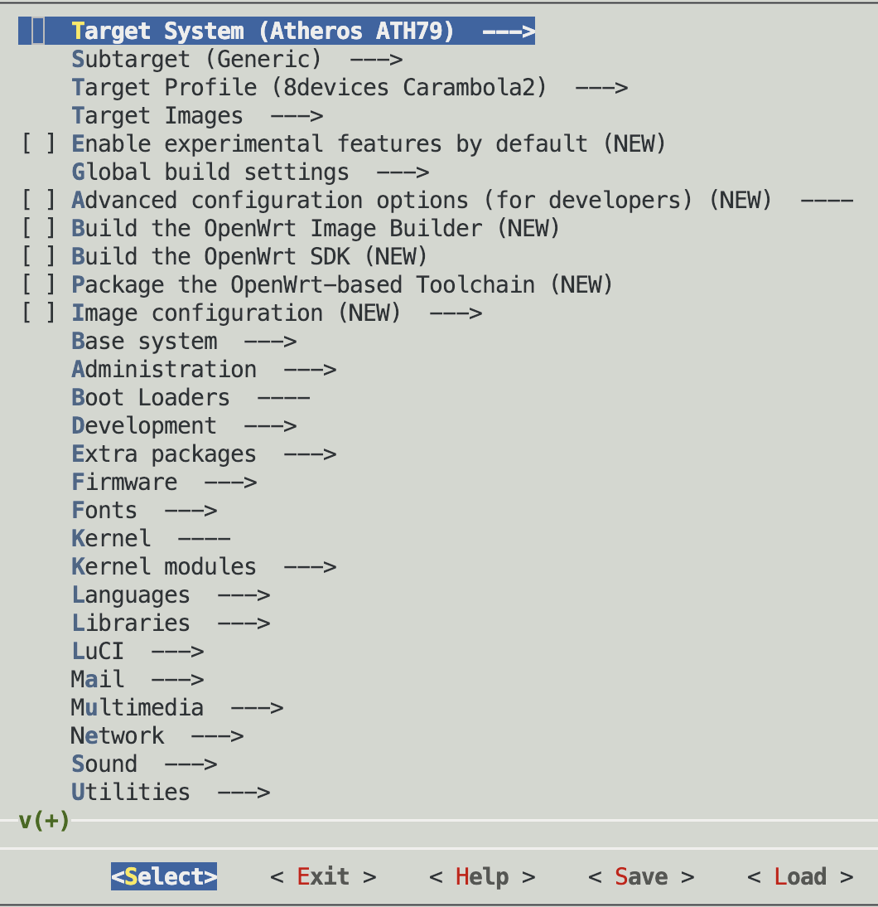
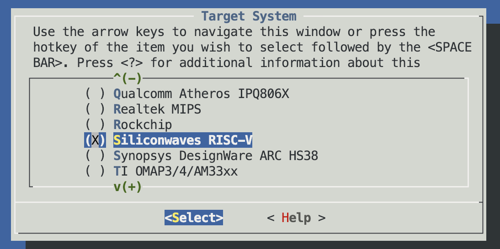
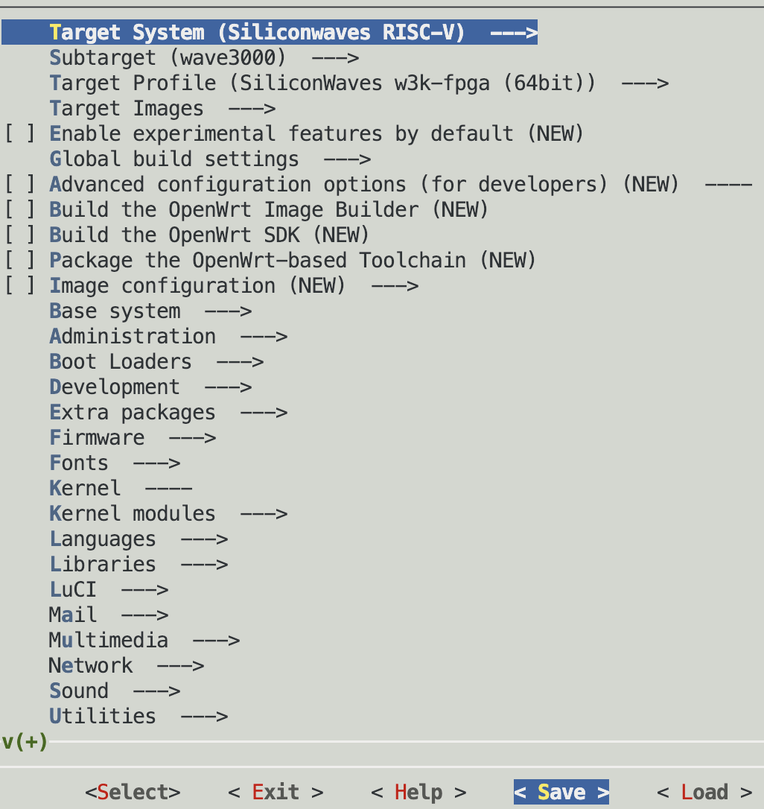

# 1. 编译环境

服务器版本：ubuntu 22.04

```
Linux super 5.19.0-44-generic #45~22.04.1-Ubuntu SMP PREEMPT_DYNAMIC Tue May 30 20:00:11 UTC 2 x86_64 x86_64 x86_64 GNU/Linux
```

ubuntu 22.04 安装必须的软件

```shell
sudo apt install cmake autoconf automake autotools-dev curl \
	libmpc-dev libmpfr-dev libgmp-dev gawk build-essential bison \
	flex texinfo gperf patchutils bc zlib1g-dev  python-dev-is-python3 \
	libtool pkg-config mingw-w64 mingw-w64-tools texlive zip gettext \
	libglib2.0-dev libpixman-1-dev swig ninja-build python3 python3-pip \
	libelf-dev quilt libpopt-dev libncurses-dev
```

python安装

```
pip3 install swig
pip3 install pylibfdt
```


# 2. 克隆代码

```
git clone git@github.com:siwaves/openwrt.git
cd openwrt
git checkout openwrt-22.03-linux-5.10.168 
```


# 3. 编译代码

## 3.1 更新feeds

```
./scripts/feeds update -a
./scripts/feeds install  -a
```

> update的时候确保packages、luci、routing、telephony都更新成功。然后再install。

## 3.2 选择siliconwaves-riscv平台

当执行make menuconfig后，出现默认的配置




Target System 选择Siliconwaves RISC-V




选择好**Siliconwaves RISC-V** 之后，




此时所有配置都会自动选择，现在选择Exit。


选择Yes，将生成.config。


## 3.3 提前下载openwrt dl文件

链接：https://share.weiyun.com/Gxg9j4Ud 密码：muj8jr

下载好之后，放到openwrt目录，然后执行命令解压：

```shell
$ tar jxvf dl-linux-5.10.168.tar.bz2 
dl/
dl/fstools-2022-06-02-93369be0.tar.xz
dl/ca-certificates_20230311.tar.xz
dl/ncurses-6.3.tar.gz
.....
```


## 3.4 最后编译：

```
make V=s -j72
```

如果编译错误，则执行make V=s 单线程编译，查看哪里编译有问题。

> 72表示cpu数量，实际改成编译服务器的CPU数量


编译成功后，在bin/targets/siliconwaves/w3k/目录下会生成openwrt-siliconwaves-w3k-siliconwaves-w3k-fpga-ext4-factory.img.gz 软件。