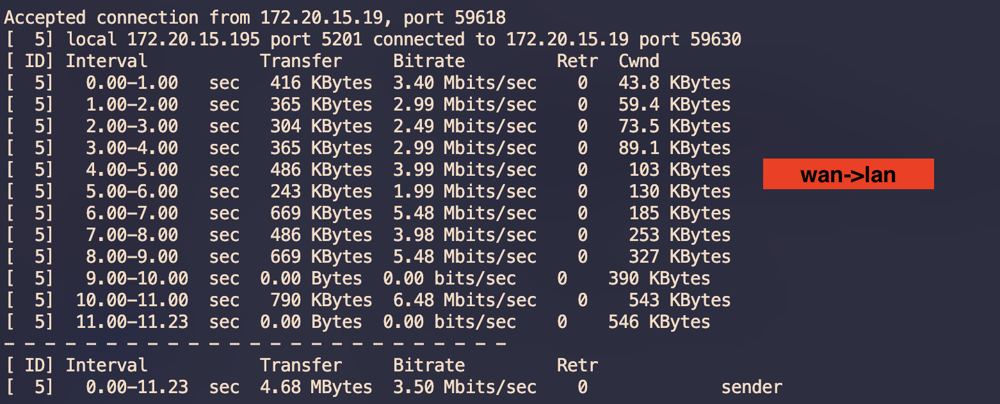

# 0. 代码库

相关代码库已从 Github 开源代码库 Fork 出来，参考下表

| 代码库地址 | 分支 |
|-----------|------|
| [openwrt](https://github.com/siwaves/openwrt/) | [openwrt-22.03-linux-5.10.168](https://github.com/siwaves/openwrt/tree/openwrt-22.03-linux-5.10.168) |
| [luci](https://github.com/siwaves/luci) | [openwrt-22.03](https://github.com/siwaves/luci/tree/openwrt-22.03)  |
| [u-boot](https://github.com/siwaves/u-boot) | [w3k-fpga](https://github.com/siwaves/u-boot/tree/w3k-fpga) |
| [packages](https://github.com/siwaves/packages) | [openwrt-22.03](https://github.com/siwaves/packages/tree/openwrt-22.03) |
| [opensbi](https://github.com/siwaves/opensbi) | [w3k](https://github.com/siwaves/opensbi/tree/w3k) |
| [telephony](https://github.com/siwaves/telephony) | [openwrt-22.03](https://github.com/siwaves/telephony/tree/openwrt-22.03) |
| [routing](https://github.com/siwaves/routing) | [openwrt-22.03](https://github.com/siwaves/routing/tree/openwrt-22.03) |


Note: 以下编译流程需要个人 Github 帐户， 并已设置 [Github SSH Key Access](https://docs.github.com/en/authentication/connecting-to-github-with-ssh/generating-a-new-ssh-key-and-adding-it-to-the-ssh-agent)。

# 1. 编译环境

OpenWRT 22.03 with Linux Kernel 5.10.168 编译流程在以下两个环境下测试过。

## 环境 1

服务器版本：ubuntu 22.04

```
Linux super 5.19.0-44-generic #45~22.04.1-Ubuntu SMP PREEMPT_DYNAMIC Tue May 30 20:00:11 UTC 2 x86_64 x86_64 x86_64 GNU/Linux
```

## 环境 2

Ubuntu 20.04 工作站 with 以下软硬件配置：


## 软件依赖

安装必须的软件包

```shell
sudo apt install cmake autoconf automake autotools-dev curl \
	libmpc-dev libmpfr-dev libgmp-dev gawk build-essential bison \
	flex texinfo gperf patchutils bc zlib1g-dev  python-dev-is-python3 \
	libtool pkg-config mingw-w64 mingw-w64-tools texlive zip gettext \
	libglib2.0-dev libpixman-1-dev swig ninja-build python3 python3-pip \
	libelf-dev quilt libpopt-dev libncurses-dev
```

python安装

```
pip3 install swig
pip3 install pylibfdt
```

# 2. 克隆代码

```
git clone git@github.com:siwaves/openwrt.git
cd openwrt
git checkout openwrt-22.03-cmcc
```


# 3. 编译代码

## 3.1 更新feeds

```
./scripts/feeds update -a
./scripts/feeds install  -a
```

> update的时候确保packages、luci、routing、telephony都更新成功。然后再install。

## 3.2 选择siliconwaves-riscv平台

执行下面两条命令生成默认的.config文件
```
cat >> .config << EOF
CONFIG_TARGET_siliconwaves=y
CONFIG_TARGET_siliconwaves_generic=y
CONFIG_TARGET_MULTI_PROFILE=y
CONFIG_TARGET_BOARD="siliconwaves"
CONFIG_TARGET_SUBTARGET="generic"
CONFIG_TARGET_ARCH_PACKAGES="riscv64_riscv64"
CONFIG_CPU_TYPE="riscv64"
CONFIG_TARGET_DEVICE_siliconwaves_generic_DEVICE_fpga-board-nor=y
CONFIG_TARGET_DEVICE_siliconwaves_generic_DEVICE_fpga-board=y
EOF
```

```
make defconfig
```

## 3.3 提前下载openwrt dl文件

为加速编译过程，部分文件已打包上传到云端，这样一次下载后，无需在每次编译过程中通过网络下载这些文件。

链接: [dl-linux-5.10.168.tar.bz2](https://pan.baidu.com/s/1yEapoGykTx4CRlDB_UNESg)

下载好之后，放到openwrt目录，然后执行命令解压：

```shell
$ tar jxvf dl-linux-5.10.168.tar.bz2 
dl/
dl/fstools-2022-06-02-93369be0.tar.xz
dl/ca-certificates_20230311.tar.xz
dl/ncurses-6.3.tar.gz
.....
```


## 3.4 最后编译：

```
make V=s -j72
```

如果编译错误，则执行make V=s 单线程编译，查看哪里编译有问题。

> 72表示cpu数量，实际改成编译服务器的CPU数量


编译成功后，在 bin/targets/siliconwaves/generic/ 目录下会生成 openwrt-siliconwaves-generic-fpga-board-ext4-sdcard.img.gz 软件。

作为参考，在环境2下，整个编译过程大概花了25分钟。

# 4. 制作w3k-fpga openwrt的启动卡

将sd卡插入读卡器，读卡器连接到ubuntu主机，然后执行命令**ls /dev/sd***, 确认是哪个描述符时sd卡。
制作启动卡的命令如下：
```
zcat openwrt-siliconwaves-generic-fpga-board-ext4-sdcard.img.gz | sudo dd of=/dev/sdX bs=512K iflag=fullblock conv=fsync status=progress
```
X替换为实际的磁盘名字即可。
执行完上述命令，启动磁盘就制作好了。
```
$ ls /dev/sdb*
/dev/sdb  /dev/sdb1  /dev/sdb2  /dev/sdb3  /dev/sdb4
```
磁盘有4个分区
| 分区 | 内容 |
|-----------|------|
|1|	u-boot-spl.bin|
|2|	u-boot.itb|
|3|	linux的内核以及设备树|
|4|	ext4格式的openwrt文件系统|

# 5. Openwrt的软件更新的方式
## 5.1 应用软件更新
1. 将sd卡拔出，插入到linux系统，使用mount命令挂载文件系统，将需要的软件拷贝到sd卡上，然后重新启动系统。x代表具体的磁盘符号
   ```
   $ sudo mount /dev/sdX4 /mnt/
   $ ls /mnt/
	bin  dev  etc  lib  lib64  lost+found  mnt  overlay  proc  rom  root  sbin  sys  tmp  usr  var  www
   ```
2. 将软件编译到openwrt生成的压缩文件中，然后使用第4条的方法，进行整个磁盘的升级。

## 5.2 linux内核更新
1. 将sd卡拔出，插入到linux系统，使用mount命令挂载第三个分区，将需要linux内核siliconwaves-w3k-fpga-kernel.bin拷贝到sd卡上。x代表具体的磁盘符号:
   ```
   $ sudo mount /dev/sdX3 /mnt/
   $ ls /mnt/
      extlinux siliconwaves-fpga-kernel.bin siliconwaves-fpga.dtb
   ```
   其中siliconwaves-fpga-kernel.bin 为经过gz压缩的linux内核，
    siliconwaves-fpga.dtb为linux内核的设备树文件。
2. 在openwrt中，修改了内核代码build_dir/target-riscv64_riscv64_musl/linux-siliconwaves_generic/linux-5.10.168，然后编译，会生成build_dir/target-riscv64_riscv64_musl/linux-siliconwaves_generic/linux-5.10.168/siliconwaves-fpga-kernel.bin。将此文件拷贝到步骤1挂载的/mnt下，即可以升级linux内核。


# 6. 调试与开发

串口线连接到开发板后，设置串口线的波特率的为115200n8

使用xilinx vivado工具烧录bit文件后，系统将自动启动，串口可以看到如下输出日志：
```
U-Boot SPL 2023.01-OpenWrt-r20114-e16929bddf (Jul 27 2023 - 09:25:19 +0000)
Trying to boot from MMC1

OpenSBI v1.0
   ____                    _____ ____ _____
  / __ \                  / ____|  _ \_   _|
 | |  | |_ __   ___ _ __ | (___ | |_) || |
 | |  | | '_ \ / _ \ '_ \ \___ \|  _ < | |
 | |__| | |_) |  __/ | | |____) | |_) || |_
  \____/| .__/ \___|_| |_|_____/|____/_____|
        | |
        |_|

Platform Name             : Siliconwaves w3k fpag board
Platform Features         : medeleg
Platform HART Count       : 2
Platform IPI Device       : aclint-mswi
......
```

在板子上，软件可以控制8个LED
| LED编号 | 作用 |
|-----------|------|
|0|用户使用|
|1|用户使用|
|2|用户使用|
|3|用户使用|
|4|linux内核启动完成后点亮|
|5|u-boot跳转到内核前点亮|
|6|u-boot启动过程中点亮|
|7|u-boot-spl点亮|

下图为FPGA board上8个LED的分布示意图：


上图为openwrt启动正常启动后的示意图。

示例代码：
[led-driver-demo](https://github.com/siwaves/openwrt/tree/openwrt-22.03-linux-5.10.168/package/siliconwaves/led-driver-demo)和[led-user-demo](https://github.com/siwaves/openwrt/tree/openwrt-22.03-linux-5.10.168/package/siliconwaves/led-user-demo)是一对示例代码。
默认这两个程序是编译到openwrt中的。
当openwrt启动后，可以执行led-lightup命令控制0-3编号的LED
```
# led-lightup -h
Usage:led-lightup [-hnv] [-n gpio-num 0-3][-v on-off 0/1]
```
例：

**led-lightup -n 2 -v 1** 点亮编号为2的LED

**led-lightup -n 3 -v 0** 熄灭编号为3的LED

# 7.网速测试

lan pc到wan pc测速结果


wan pc 到 lan pc测度结果

